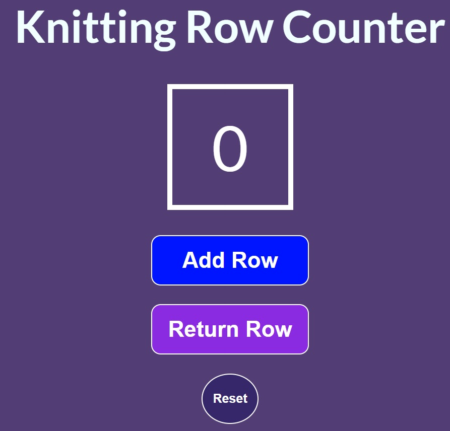

# https://knitting-rows-counter.netlify.app/

Esta aplicación realizada con React y JavaScript consta de tres botones que permiten a la persona usuaria contar las vueltas durante el tejido. 
Permite además devolverse de una vuelta por click o retornar el contador a ceros de ser necesario.

Su sencilla interfaz hace que cualquier persona pueda entender su funcionamiento y usarla de manera práctica.

Realizada con <3 Por Ale Salazar, inspirada en el curso de freeCodeCamp. Gracias a Estefanía Cassingena.

favicon icon from <a href="https://www.flaticon.com/free-icons/crochet" title="crochet icons">Crochet icons created by Becris - Flaticon</a>
